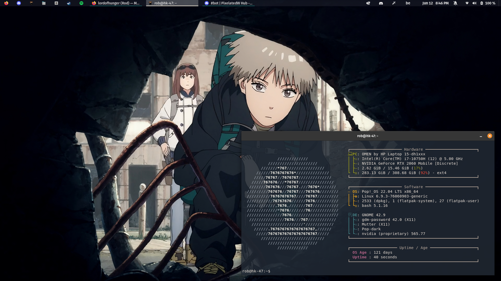
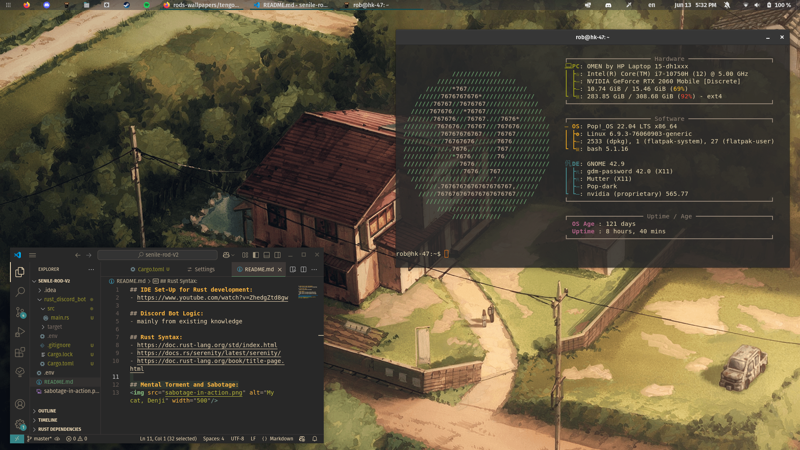
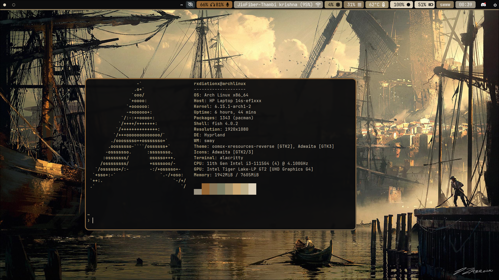

# Rod's Wallpapers

A hand-picked collection of wallpapers, containing anime, art, abstract, pictures and moods.  
Gathered from forums, archives, screenshots, and friends. Some were used in rices, others were not.

> Featuring: *Chainsaw Man*, *Tengoku Daimakyou*, liminal spaces, schematics, programming, and more.

---

### Folder Layout

All wallpapers live in `wallpapers/`, grouped thematically and numbered for structure.  
Each folder contains a local `README.md` for previews and description.

There are **534 wallpapers** across **40 folders** and growing.
Requests that are not wallpapers (videos, colour schemes) can be found in 'other-requests'.

- `00–09`: Anime, general and specific, as well as ghibli movies 
- `10–19`: Digital/technical art & design  
- `20–29`: Real-world photography  
- `30–39`: Colour-based, stylistic, abstract  
- `40–49`: Feeling-driven, eerie, comforting, empty

---

### Preview Examples

A few themed setups below. Click to view full size.

<table>
<tr>
<td align="center">
<br/>
<sub><code>td-maru</code> with custom kitty theme</sub>
</td>
<td align="center">
<br/>
<sub><code>td-house</code> in Gruvbox-style setup</sub>
</td>
<td align="center">
<br/>
<sub><code>freedom-of-the-seas</code> by RadiationX</sub>
</td>
</tr>
</table>

---

### How to Use

- Clone or download the repo or individual wallpapers  
  ```bash
  git clone https://github.com/lordofhunger/wallpapers
  ```
- Use them in your setups, modify them, ...  
- Feel free to star the repo if you enjoyed it, this would be much appreciated. ❤️

---

### Coming Soon

- Matching **colour schemes**?
- More themed **rice examples**?
- Your own submissions? (DM `.lordofhunger` on Discord)

---

### Attribution

I don’t own most of the artworks. If you’re the artist (or know them), feel free to reach out and I will gladly credit or remove it.  
Some were found on old drives and their origins are lost to time.

The following folders contain wallpapers clearly based on or directly taken from existing works:

- `01-one-piece`: Artwork based on or belonging to Eiichiro Oda and Toei Animation.  
- `02-tengoku-daimakyou`: Images from the anime by Production I.G, based on the manga by Masakazu Ishiguro.  
- `03-csm`: Content from the Chainsaw Man manga by Tatsuki Fujimoto (published by Shueisha), and the anime adaptation by Mappa.  
- `05-doraemon`: Images from the Doraemon anime and manga.  
- `06-fruits-basket`: Wallpapers sourced from the Fruits Basket anime and movies.  
- `07-neon-genesis-evangelion`: Images from the Neon Genesis Evangelion series, End of Evangelion movie, and derivative art by third parties.  
- `08-studio-ghibli`: Art created by or based on works by Studio Ghibli.


Thank you to the original artists, designers, and photographers whose work makes digital spaces beautiful.

---

### Legal Disclaimer

This repository is maintained from Belgium and is subject to Belgian and European Union copyright law.

The wallpapers collected here are shared **non-commercially**, with no claim of ownership over the original artworks.  
They are intended for **personal, aesthetic, and educational use** as part of a curated archival project. No profit is made or intended.

Where possible, attribution is provided. If you are the original creator or rights-holder of a work and wish it to be removed or credited more accurately, please contact me via GitHub issues or Discord: `.lordofhunger`.

Under Belgian and EU copyright law — including the Belgian *Code of Economic Rights* and the European Copyright Directive (Directive (EU) 2019/790) — this kind of **good faith, non-commercial curation** typically falls under exceptions and limitations such as quotation, educational use, or pastiche, especially when no market harm is intended or caused.

If this project violates your rights or intentions as a creator, I will respond to requests promptly and in good faith.

---

-rod
