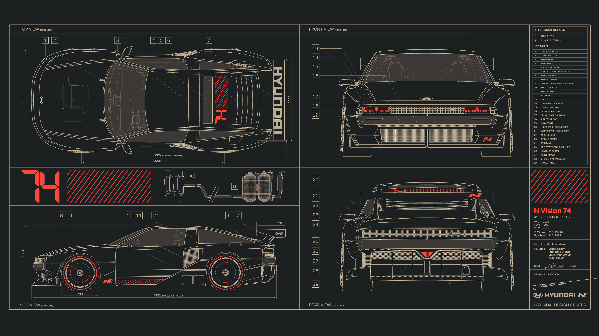

# 🎴 Aesthetic Wallpapers Collection

Personal collection of wallpapers gathered over the years — some I've used in my rices, others I just found neat. Mostly anime-inspired, with an emphasis on darker, emotional, or atmospheric styles.

> 🌌 Featuring **Chainsaw Man**, **Tengoku Daimakyou / Heavenly Delusion**, and more.

---

### 🗂️ Structure
**Each folder has a README showing off all the wallpapers.**  
Wallpapers are sorted into folders by theme, series, or aesthetic.  
There are currently **177 wallpapers** across **22 categories**.  

|  |  |  |  |  |
|-------------------------|-------------------------|-------------------------|-------------------------|-------------------------|
| General Anime           | Bridge                  | colours                 | comfort                 | Chainsaw Man            |

|  |  |  |   |  |
|-------------------------|-------------------------|-------------------------|--------------------------|---------------------------|
| Desolate                | Dominant Colour         | Eerie                   | Forests                  | Lakes                     |

|  |  |  |  |  |
|---------------------------|---------------------------|---------------------------|---------------------------|---------------------------|
| One Piece                 | Operating Systems         | Other Art                 | Other Images              | Own Pictures              |

|  |  |  |  |  |
|---------------------------|---------------------------|---------------------------|---------------------------|---------------------------|
| Pokémon                 | Programming                 | Schematics                 | Ships                 | Heavenly Delusion                 |

|  |  | |  |  |
|---------------------------|---------------------------|---------------------------|---------------------------|---------------------------|
| Video Games                 | Winter                 |             |            |               |

---

### 🧩 Previews

This first example uses tengoku-daimakyou_heavenly-delusion/td-maru.png and a kitty colour scheme that can be found in examples, 
the colour scheme is based on the wallpaper.

The second example uses tengoku-daimakyou_heavenly-delusion/td-house.png and a kitty colour scheme based on the gruvbox colour scheme, 
the vscode theme is nathans gruvbox.

  

This example is a rice by RadiationX from the r/unixporn discord, who granted me permission to share it here.  
The image can be found in ships/freedom-of-the-seas.png.  

 

---

### ✒️ Credits

I don’t own these artworks. If you’re the artist (or know them), feel free to reach out and I’ll gladly credit or remove it.  
Many of these were found on my old system so I don't always exactly know where I got them.

---

### 📥 How to Use

- Clone or download the repo or individual wallpapers  
	`git clone https://github.com/lordofhunger/rods-wallpapers`  
- Use them as wallpapers, share them in your setups

---

### ✨ Also check out

I'm working on matching **colour schemes** and **terminal rices** for some of these wallpapers. These will be linked here soon. Example setups may follow.

---

-rod

